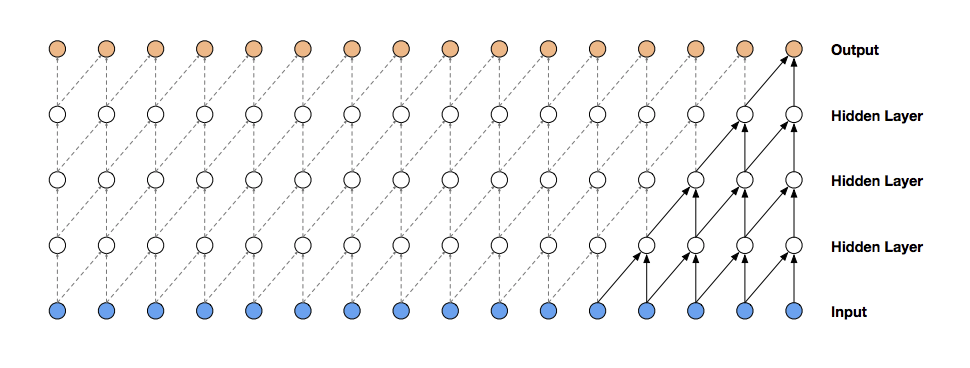

# wavenetlike

[](https://travis-ci.com/redwrasse/wavenetlike)

**Note: This library is a work in progress for generalized wavenet-like architectures. To train the original Wavenet on the Speech Commands dataset, run this [script](wavenetlike/examples/wavenet.py), or [this one](wavenetlike/examples/wavenet_tpu.py) for TPUs. To access other library functionality currently work directly with source (see examples below). To train on [Colab](https://colab.research.google.com/) with TPUs use this [script](scripts/colab_wavenet_tpu).** 

### Background
A library for building wavenet-like models: generative auto-regressive models with large receptive fields. The canonical example is of course [Wavenet](https://arxiv.org/pdf/1609.03499.pdf) itself.

Wavenet is just one in a family of models providing long receptive fields with a reasonable number of parameters. The specific model depends on the data and use case. This library is intended to help build appropriate models within this family with reduced work, rather than present the current state of the art.

As a first step this library just exposes the parameters of wavenet-type models: number of layers, dilation rate, internal channel size, etc. Nothing too special there. As a second step though, it makes sense to help specifying these parameters based on the specific data being trained- its correlation lengths and resolution, for example. This is the much harder goal.

Formally this library is based off the fact that any data series`{x_i]` with an ordering relation and presumed translation invariance is amenable to a general framework for a 'causal' generative model

```
P(x_1, ...., x_n) = \prod_i P(x_i|x_i-n,...., x_i-1)                        
min_{params} -log P(data; params)
```

This library is built on the [Pytorch API](https://pytorch.org/docs/stable/index.html).

### Concepts
There are a large number of possible architecture choices and parameter tweaks, but a few
are of primary interest

* waveform sample frequency and expected correlation length.
* `gamma` := ratio of the total # of parameters / network depth.
* `Delta` := receptive field length of the network.




At its core Wavenet-like models are just about combining increasingly dilated convolutions to generate
autoregressive models with large `Delta` and small  `gamma`. The rest are possible architectural tricks like
gated activations, skip-residual connections, and waveform discretization.

The original Wavenet as published trains on audio with sample frequencies of ~16,000 samples/second,
with multiple (3-5) blocks of dilated convolutions generating a receptive field on the order of ~200-300ms,
or a receptive field length of ~3200-4800 samples.


For possible architecture choices and parameter tweaks see separate page (tbd).

For a discussion of technical and mathematical details see separate page (tbd).

### Docs

Docs are built with [Sphinx](https://www.sphinx-doc.org/en/master/). For the time being please build docs locally, following this [script](scripts/update_docs).
Some of the documentation has been copied into this readme.

### Tests

```
python3 -m unittest discover
```

### Building blocks API

A standardized API is intended to build models from constituent building blocks: dilated convolutions, skip-residual connections, activations, possible discretization. This is a work in progress -tbd.

### Datasets

Formal datasets provided

* An AR(2) autoregressive model, `X_t = c + a X_{t-1} + b X_{t-2} + \epsilon_t`. Parameters `a, b` will match network weights in a single trained convolutional layer of kernel length 2.
* The [Speech Commands](https://ai.googleblog.com/2017/08/launching-speech-commands-dataset.html) audio dataset.
* Custom Dataset: load custom waveforms (tbd)

### Analyzer

Analyzer operations are intended (tbd) as analysis of dataset and model properties, eventually ideally suggesting model architecture. These operations are tbd,
based on such parameters like `gamma, Delta`.

```python

analyze_dataset(dataset) # sample frequency, correlation lengths
analyze_model(model) # Delta, gamma
# help with model determination based off dataset
# properties ....

```

### Examples

See [examples](./wavenetlike/examples) directory for scripts.

* The AR(2) model can be learned immediately with a single convolutional layer and as a discriminative Gaussian model.

```python

    # current form
    model = build_ar2()
    data = dataset.AR2().get_dataset()
    train.train_stack_ar(model, data, loss_type=ops.Losses.mse)
    
```

* A toy Wavenet model (fewer parameters and a mu-quantization of 10 rather than 256) achieves ~50% training accuracy in a minute on the [Speech Commands](https://ai.googleblog.com/2017/08/launching-speech-commands-dataset.html) dataset. Of course, its predictions with be commensurably coarse.

```python

    # current form
    model = build_wavenet_toy()
    dataset = ops.download_sample_audio(cutoff=5).get_dataset()
    train.train(model, dataset)
    
```

* Full Wavenet on the [Speech Commands](https://ai.googleblog.com/2017/08/launching-speech-commands-dataset.html) dataset.
```python

    # current form
    model = build_wavenet()
    dataset = ops.download_sample_audio(cutoff=5).get_dataset()
    train.train(model, dataset)

```

### To Do

This library is a work in progress. Some future tasks

* Support conditioning on a variable (see  [Wavenet paper](https://arxiv.org/pdf/1609.03499.pdf)).
* Support easy distributed training on TPUs.
* Provide an intelligent workflow from dataset to model selection.
